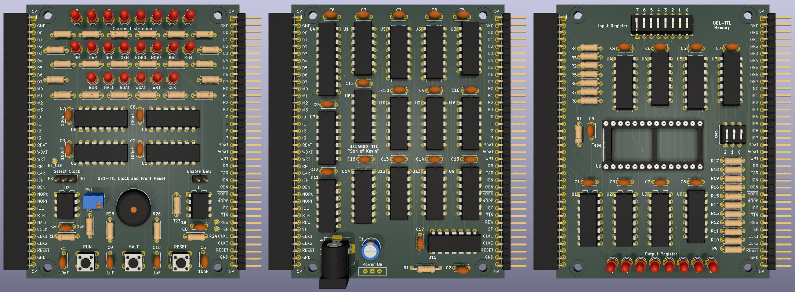

UE-1 Computer in TTL
====================

## What is this?

This is an implementation of the [Usagi Electric UE-1 vacuum tube computer architecture](https://github.com/Nakazoto/UEVTC/wiki)
in TTL logic.  It runs the same code as the original.

## Specifications

* TTL logic and EEPROM chips only, no cheating with a modern microcontroller
  running an emulator.
* 1-bit processor core based on the UE14500.
* 8-bit scratch register (general-purpose RAM).
* 8-bit output register.
* 7-bit input register.
* EEPROM that stores up to 8 program "tapes", each up to 4096 instructions.
  DIP switches select which program to run.
* 555-based clock that runs at frequencies between 0.7Hz and 480Hz.
* Run, Halt, and Reset buttons to control the computer.
* Blinken lights!
* Bell buzzer.
* Runs off a single 5V DC supply.

The computer is split across three PCB's, because:

* PCB's less than 100mm x 100mm in size are cheaper to get made.
* The aspect ratio of the boards is close to those of the wooden backing
  boards in the original UE-1 to provide a similar visual aesthetic
  (although I need 3 boards compared with the original 2).
* It is easier to upgrade one of the boards without having to re-spin
  the other boards.

## Schematics

* [Processor board](schematics/UE14500-TTL/PDF/UE14500-TTL.pdf)
* [Clock and front panel board](schematics/UE1-TTL-Clock/PDF/UE1-TTL-Clock.pdf)
* [Memory and I/O board](schematics/UE1-TTL-Memory/PDF/UE1-TTL-Memory.pdf)

## Programming the computer

To reprogram the computer it is necessary to remove the 32K AT28C256 tape
EEPROM from the memory board and flash in a new set of tape images using an
EEPROM programmer.

There can be up to 8 programs in the EEPROM, with DIP switches to select
which program to run.  Each program is up to 4096 instructions long,
which corresponds to about 10m of paper tape.  Each instruction consists
of a 4-bit opcode and a 4-bit memory address just like in the vacuum tube
based UE-1.

Pad shorter programs with NOP0 instructions or replicate the program
multiple times to fill up the 4096 bytes of space.  There is a new
"rewind" opcode that can be used to loop short programs without
excessive NOP0's.  See the next section.

## Instruction set

This computer uses the same [instruction set](https://github.com/Nakazoto/UEVTC/wiki/UE14500-Processor)
as the original computer.  The only difference is the introduction of a
"rewind" opcode which is encoded as "NOP0" with a memory address between
8 and 15 - bytes $08 to $0F in hexadecimal.

The rewind opcode causes the 12-bit program counter to reset back to 0
immediately, rather than waiting for the program counter to wrap around.
This can be convenient for short looping programs to avoid a long wait
for the loop to restart.

## Parts lists

In the parts lists below, "RLED" refers to the inline series resistor
for the LED's.  The value depends upon the type of LED you have, and can
be calculated from the LED's voltage drop (VLED) and rated current (ILED)
as follows:

    RLED = (5 - VLED) / ILED

For example, if your LED is rated for 1.9V and 10mA, then RLED should be
at least (5 - 1.9) / 0.01 = 310 ohms.  A 330 ohm resistor will do.
I recommend using LED's with 2mA or less current rating to avoid putting
too much strain on the TTL logic outputs.

The IC's are listed as 74LS series, but you can use 74HC series instead.
Use the same series for all chips.

Parts lists for individual boards are listed first, and then a combined
parts list for the whole computer.

### Processor board

* 3 x 74LS00 quad NAND gate
* 3 x 74LS02 quad NOR gate
* 2 x 74LS08 quad AND gate
* 3 x 74LS74 dual D flip-flop
* 1 x 74LS86 quad XOR gate
* 2 x 74LS138 3-to-8 line decoder
* 1 x 74LS251 8-line to 1-line multiplexer
* 1 x 74LS374 8-bit register
* 1 x 100uF electrolytic capacitor
* 1 x 1uF ceramic or monolithic capacitor
* 16 x 100nF ceramic or monolithic capacitor
* 1 x 10K resistor
* 1 x SPDT 2.54mm slide switch
* 1 x 2.5mm DC barrel jack
* 2 x 36-pin terminal header or socket (or one of each)

If you wish to use IC sockets, then you will also need:

* 12 x 14-pin DIP socket
* 3 x 16-pin DIP socket
* 1 x 20-pin DIP socket

### Clock and front panel board

* 2 x 555 timer
* 1 x 74LS74 dual D flip-flop
* 1 x 74LS02 quad NOR gate
* 1 x 74LS08 quad AND gate
* 1 x 74LS132 quad NAND gate with Schmitt trigger
* 2 x 10nF ceramic or monolithic capacitor
* 4 x 100nF ceramic or monolithic capacitor
* 4 x 1uF ceramic or monolithic capacitor
* 1 x 1M trimpot
* 2 x 1K resistor
* 1 x 3K3 resistor
* 1 x 4K7 resistor
* 1 x 10K resistor
* 1 x 100K resistor
* 22 x RLED resistor
* 22 x 3mm LED (colour of your choice)
* 1 x Buzzer with 7.6mm pin pitch
* 3 x 6mm momentary push button
* 1 x 3-way 2.54mm pin header
* 1 x 2-way 2.54mm pin header
* 2 x 2.54mm jumper
* 2 x 36-pin terminal header or socket (or one of each)

If you wish to use IC sockets, then you will also need:

* 2 x 8-pin DIP socket
* 4 x 14-pin DIP socket

### Memory and I/O board

* 1 x AT28C256 32K x 8 EEPROM
* 1 x 74LS32 quad OR gate
* 1 x 74LS139 dual 2-to-4 line decoder
* 2 x 74LS251 8-line to 1-line multiplexer
* 2 x 74LS259 8-bit addressable latch
* 2 x 74LS393 dual binary 4-bit counter
* 9 x 100nF ceramic or monolithic capacitor
* 1 x 10K resistor
* 10 x 100K resistor
* 8 x RLED resistor
* 8 x 3mm LED (colour of your choice)
* 1 x 8-way DIP switches
* 1 x 3-way DIP switches
* 2 x 36-pin terminal header or socket (or one of each)

If you wish to use IC sockets, then you will also need:

* 3 x 14-pin DIP socket
* 5 x 16-pin DIP socket
* 1 x 28-pin DIP socket (15.24mm pitch width)

I recommend using a socket for the 28-pin EEPROM even if you don't use
sockets for the other chips.  You will need to easily remove the EEPROM to
reprogram it.

## Combined part list

This section combines all three lists into one to make it easier to
order the parts for the whole computer.  As stated before, 74HC series
chips can be used in place of 74LS.

* 1 x AT28C256 32K x 8 EEPROM
* 2 x 555 timer
* 3 x 74LS00 quad NAND gate
* 4 x 74LS02 quad NOR gate
* 3 x 74LS08 quad AND gate
* 1 x 74LS32 quad OR gate
* 4 x 74LS74 dual D flip-flop
* 1 x 74LS86 quad XOR gate
* 1 x 74LS132 quad NAND gate with Schmitt trigger
* 2 x 74LS138 3-to-8 line decoder
* 1 x 74LS139 dual 2-to-4 line decoder
* 3 x 74LS251 8-line to 1-line multiplexer
* 2 x 74LS259 8-bit addressable latch
* 1 x 74LS374 8-bit register
* 2 x 74LS393 dual binary 4-bit counter
* 1 x 100uF electrolytic capacitor
* 5 x 1uF ceramic or monolithic capacitor
* 2 x 10nF ceramic or monolithic capacitor
* 29 x 100nF ceramic or monolithic capacitor
* 1 x 1M trimpot
* 2 x 1K resistor
* 1 x 3K3 resistor
* 1 x 4K7 resistor
* 3 x 10K resistor
* 11 x 100K resistor
* 30 x RLED resistor
* 30 x 3mm LED (colour of your choice)
* 1 x SPDT 2.54mm slide switch
* 1 x 2.5mm DC barrel jack
* 1 x Buzzer with 7.6mm pin pitch
* 3 x 6mm momentary push button
* 1 x 3-way 2.54mm pin header
* 1 x 2-way 2.54mm pin header
* 2 x 2.54mm jumper
* 1 x 8-way DIP switches
* 1 x 3-way DIP switches
* 4 x 36-pin terminal header (for clock and memory boards)
* 2 x 36-pin terminal socket (for CPU board)

If you wish to use IC sockets, then you will also need:

* 2 x 8-pin DIP socket
* 19 x 14-pin DIP socket
* 8 x 16-pin DIP socket
* 1 x 20-pin DIP socket
* 1 x 28-pin DIP socket (15.24mm pitch width)

The 28-pin DIP socket is recommended even if you don't use sockets for
everything else.

## License

UE-1 TTL by Rhys Weatherley is licensed under <a href="http://creativecommons.org/licenses/by-nc-sa/4.0/?ref=chooser-v1" target="_blank" rel="license noopener noreferrer" style="display:inline-block;">Attribution-NonCommercial-ShareAlike 4.0 International</a>

## Contact

For more information on this project, to report bugs, or to suggest
improvements, please contact the author Rhys Weatherley via
[email](mailto:rhys.weatherley@gmail.com).
