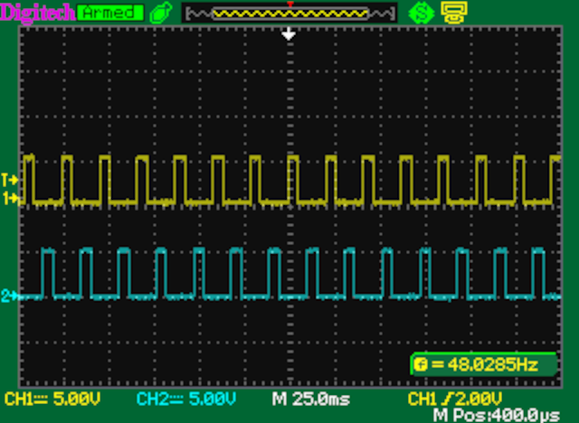

Assembling and Testing the Clock Board
======================================

## Parts

* 2 x 555 timer
* 1 x 74LS74 dual D flip-flop
* 1 x 74LS02 quad NOR gate
* 1 x 74LS08 quad AND gate
* 1 x 74LS132 quad NAND gate with Schmitt trigger
* 2 x 10nF ceramic or monolithic capacitor
* 4 x 100nF ceramic or monolithic capacitor
* 4 x 1uF ceramic or monolithic capacitor
* 1 x 1M trimpot
* 2 x 1K resistor
* 1 x 3K3 resistor
* 1 x 4K7 resistor
* 1 x 10K resistor
* 1 x 100K resistor
* 22 x RLED resistor (choose to suit the properties of the LED's)
* 22 x 3mm LED (colour of your choice)
* 1 x Buzzer with 7.6mm pin pitch
* 3 x 6mm momentary push button
* 1 x 3-way 2.54mm pin header
* 1 x 2-way 2.54mm pin header
* 2 x 2.54mm jumper
* 2 x 36-pin right-angle terminal header
* 2 x 8-pin DIP socket
* 4 x 14-pin DIP socket

## Assembling

Start in the usual way with the low profile components and work up in height:

* Resistors; most of the values are marked, except the LED series resistors.
* Pin headers along the left and right edges
* LED's, short lead in the square hole (cathode) and long lead into the
  round hole (anode).
* Run, Halt, and Reset push buttons
* IC sockets
* Capacitors, noting the three different values of 10nF, 100nF, and 1uF that
  are marked on the board.
* Buzzer
* 3-pin and 2-pin headers
* Variable resistor RV1
* Add a jumper on the INT side of the "Select Clock" 3-pin header
* Add a jumper to the "Enable Bell" 2-pin header

Do a quick test with a multimeter to make sure there is no short
between 5V and ground.  Then insert the IC's into the sockets:

* U1 - 74LS74
* U2 - 74LS08
* U3 - 555
* U4 - 555
* U5 - 74LS132
* U6 - 74LS02

## Testing

## Stop/Run

Connect 5V and GND to a bench power supply.  Also jumper /RESET and /NOPF
to 5V temporarily.  If you don't do this, the Stop/Run circuit may get
stuck in halt due to the floating pins.

Turn the power on and the halt light should turn on.

Press RUN, the halt light should turn off, the run light should turn on,
and the clock light should start blinking.  If this doesn't happen,
turn off the board, check that the IC's are in the right sockets and
that there are no shorts or bad solder joints on the board.

Press HALT, then RUN, and back again a few times to check that clock
starts and stops as expected when the buttons are pressed.

## Clock

Press RUN.  Adjust RV1 and check that the blink rate changes with resistance.
An oscilloscope can be used to check it.  Connect the probe to the
INT\_CLK test point and adjust RV1.  It should be possible to adjust
the frequency up to 480Hz.  Note that the CLK light blinks at half the
rate of INT\_CLK.

Connect an oscilloscope to CLK1 and CLK2 on the edge connectors,
press RUN, and check that the clock phases alternate properly:

## LED's

Most of the LED's are connected to pins on the edge pin headers, so they
can be tested one at a time by connecting either 5V or GND to each pin.

Current instruction:

* Bit 0 - M0 - active-high, connect to 5V
* Bit 1 - M1 - active-high
* Bit 2 - M2 - active-high
* Bit 3 - M3 - active-high
* Bit 4 - I0 - active-high
* Bit 5 - I2 - active-high
* Bit 6 - I3 - active-high
* Bit 7 - I4 - active-high

Active-high control lines (connect to 5V): RR, CAR, IEN, OEN, RDAT, WDAT, WRT.

Active-low control lines (connect to GND): NOP0, NOPF, IOC, RTN.

If you are lucky, the buzzer should also beep when you connect IOC to GND.
I wasn't lucky.  I think I have something wrong with the buzzer/bell circuit.
