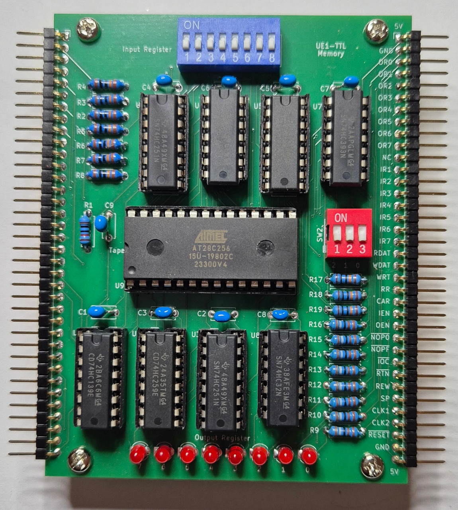

Assembling and Testing the Memory and I/O Board
===============================================

Note: Build the [clock board](testing_clock.md) and
[processor board](testing_processor.md) first.

## Parts

* 1 x AT28C256 32K x 8 EEPROM
* 1 x 74LS32 quad OR gate
* 1 x 74LS139 dual 2-to-4 line decoder
* 2 x 74LS251 8-line to 1-line multiplexer
* 2 x 74LS259 8-bit addressable latch
* 2 x 74LS393 dual binary 4-bit counter
* 9 x 100nF ceramic or monolithic capacitor
* 1 x 10K resistor
* 10 x 100K resistor
* 8 x RLED resistor (choose to suit the properties of the LED's)
* 8 x 3mm LED (colour of your choice)
* 1 x 8-way DIP switches
* 1 x 3-way DIP switches
* 2 x 36-pin right-angle terminal header
* 3 x 14-pin DIP socket
* 5 x 16-pin DIP socket
* 1 x 28-pin DIP socket (15.24mm pitch width)

The IC's are listed as 74LS series, but you can use 74HC series instead.
Use the same series for all chips.

I recommend using a socket for the 28-pin EEPROM even if you don't use
sockets for the other chips.  You will need to easily remove the EEPROM to
reprogram it.

## Assembling

Start in the usual way with the low profile components and work up in height:

* Resistors
* Pin headers along the left and right edges
* LED's
* IC sockets
* Capacitors, which are all 100nF
* DIP switches

Do a quick test with a multimeter to make sure there is no short
between 5V and ground.  Then insert the IC's into the sockets:

* U1 - 74LS139
* U2 - 74LS259
* U3 - 74LS251
* U4 - 74LS251
* U5 - 74LS259
* U6 - 74LS393
* U7 - 74LS393
* U8 - 73LS32
* U9 - AT28C256

## Testing

Connect the clock, processor, and memory boards together with the
processor board in the middle.

Burn a 32K x 8 EEPROM with the contents of the "UE1TEST.ROM" file in the
"programs" directory of this repository.

Select program 0 on the three DIP switches on the right of the memory
board.  Then turn the computer on.  Press the RUN button and the program
should start running.

Program 0 of the test image is Usagi Electric's classic "UE1FIBO"
example, which calculates Fibonacci up to 21.  You should see the
output register LED's count 1, 2, 3, 5, 8, 13, and then 21.  The
program should then ring the bell and halt.

If this doesn't work, then you will probably need to get the oscilloscope
out and debug it.

If it does work, then select program 2, press RESET and then RUN.
This runs the "UE1 DIAPER1" test program, which tests the entire
instruction set of the UE1 looking for faults.  See the source file
"programs/UE1\_DIAPER1\_V2.ASM" for instructions.

If "UE1 DIAPER1" passes, then select program 3, press RESET and then RUN.
This is the "UE1 DIAPER2" program which tests inputs and outputs.
The values on input switches IR1 to IR7 are copied to OR1 to OR7 every
loop iteration.  OR0 will be set to the even parity of the other 7 bits.
