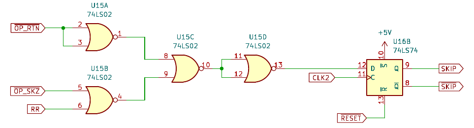
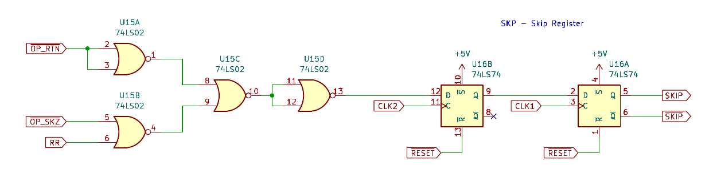

Assembling and Testing the Processor Board
==========================================

Note: Build the [clock board](testing_clock.md) first.

## Parts

* 3 x 74LS00 quad NAND gate
* 3 x 74LS02 quad NOR gate
* 2 x 74LS08 quad AND gate
* 3 x 74LS74 dual D flip-flop
* 1 x 74LS86 quad XOR gate
* 2 x 74LS138 3-to-8 line decoder
* 1 x 74LS251 8-line to 1-line multiplexer
* 1 x 74LS374 8-bit register
* 1 x 100uF electrolytic capacitor
* 1 x 1uF ceramic or monolithic capacitor
* 16 x 100nF ceramic or monolithic capacitor
* 1 x 10K resistor
* 1 x SPDT 2.54mm slide switch
* 1 x 2.5mm DC barrel jack
* 2 x 36-pin right-angle terminal socket
* 12 x 14-pin DIP socket
* 3 x 16-pin DIP socket
* 1 x 20-pin DIP socket

The IC's are listed as 74LS series, but you can use 74HC series instead.
Use the same series for all chips.

## Assembling

Start in the usual way with the low profile components and work up in height:

* 10K resistor R1
* Pin sockets along the left and right edges
* IC sockets
* Capacitors; C1 is 100uF electrolytic, C2 is 1uF, all others are 100nF.
* SPDT slide switch
* 2.5mm DC barrel jack

Do a quick test with a multimeter to make sure there is no short
between 5V and ground.  Then insert the IC's into the sockets:

* U1 - 74LS08
* U2 - 74LS08
* U3 - 74LS00
* U4 - 74LS374
* U5 - 74LS138
* U6 - 74LS138
* U7 - 74LS74
* U8 - 74LS02
* U9 - 74LS02
* U10 - 74LS74
* U11 - 74LS00
* U12 - 74LS86
* U13 - 74LS00
* U14 - 74LS251
* U15 - 74LS02
* U16 - 74LS74

## Testing

Make sure the power switch is in the right position and then power on the
board on its own with a bench power supply set to 5V.  The current draw
should be in the tens of milliamps at most.

Power off the board and connect it to the clock board.  Then re-power
the two boards together.

Some of the lights should turn on.  The instruction will be random
because the memory board is not connected.  Press and hold the RUN button
and the LED's should blink like crazy.  When you release the button
the machine will probably halt with NOPF set.  It may run for a while
on random instructions.

Press the RESET button.  RR and CAR should turn off.  IEN and OEN should
turn on.  This should confirm that the processor is basically working.
We will need memory to test anything else.

Next: [Assembling and testing the memory board](testing_memory.md).

## Version 1 mistakes

I made a mistake in the generation of the WRITE signal.  I was gating it
based on CLK1 to trigger memory writes on the falling edge of CLK1:

However, this could cause invalid data to be written to memory when the next
instruction was loaded on the following CLK1 rising edge.  Moving WRITE
to CLK2 fixes the problem:

This is fixed in the schematic and gerbers for version 2 of the processor board.

As a consequence of moving the WRITE signal to the falling edge of CLK2,
the SKZ instruction stopped working.  The SKIP state could reset
mid-instruction, causing the current skipped instruction to "un-skip".

This is the original skip circuit:

And this is the updated version, which "double-buffers" the SKIP value:

The SKIP register is updated on the rising edge of CLK2 as before,
but the value does not become active until the rising edge of CLK1
during the next instruction.  This avoids an "un-skip" occurring in
the middle of an instruction.
