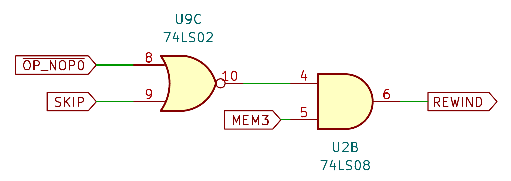
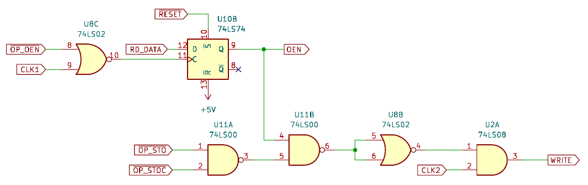

UE1 TTL Computer Theory of Operation
====================================

## Overview

This page explains the theory of operation of the TTL version of the UE1.

The design is not gate-compatible with the original NOR gate heavy
vacuum tube computer.  I wimped out and used dedicated TTL chips for
flip-flops, AND/OR/NAND/XOR gates, multiplexers, decoders, memory chips, etc.
The design runs the same code, but not in the same way.

In the sections below, "P/Un" is used to refer to IC's on the processor
board, "C/Un" is used to refer to IC's on the clock board, and
"M/Un" is used to refer to IC's on the memory board.

## Clock

The processor requires a two-phase clock, delivered on the CLK1 and CLK2
pins of the edge connector.  The waveforms look like this:

* Rising edge of CLK1 - Load the next instruction into the instruction register.
* Falling edge of CLK1 - Perform the instruction; update registers and memory.
* Rising edge of CLK2 - Update the SKIP register.
* Falling edge of CLK2 - Increment the program counter / tape position.

The original UE1 also has a two-phase clock, which it achieves with an
RC delay on CLK1 to produce CLK2.  The two clock pulses overlap which
makes it closer to one clock cycle per instruction than my design.

The clock board derives CLK1 and CLK2 from the MAIN\_CLK signal.
C/U3 on the clock board is a 555 timer that provides the MAIN\_CLK
between 0.7Hz and 480Hz.  This is divided by two by C/U1 and C/U2 to
create CLK1 and CLK2:

The /HALTED signal forces both clocks to zero when the machine halts.
If /HALTED goes high again in the middle of a MAIN\_CLK pulse, then it may
cause a phantom pulse on CLK2 before the next CLK1 pulse.

Phantom CLK2 pulses may advance the program counter by an extra instruction
after a NOPF/HLT instruction.  A NOP0 or two after a NOPF/HLT ensures
that phantom CLK2 pulses will have no effect on the program when it resumes.
This is no different than the original UE1 which requires some NOP0 padding
after NOPF/HLT to allow the tape motor to slow down and stop.

If /HALTED goes low in the middle of a CLK1 pulse or before the rising
edge of CLK2, then the current instruction will be completed but the SKIP
register will not be updated and the program counter will not be incremented.

The maximum CPU speed is 240 instructions per second.  If you want to run the
computer faster than that, you can move the "Select Clock" jumper to the EXT
position and inject your own MAIN\_CLK from off-board.

## Run/Stop Control

The Run/Stop circuit on the clock board handles the "Run" and "Halt"
push buttons.  When the computer resets at power-on, the system
will eventually settle into a state with /HALTED low and /RUNNING high.
Pressing "Run" will change /RUNNING to low, /HALTED to high, and the
two-phase clock will start ticking.

The "Reset" button is on the clock board, but its RC network is on
the CPU board.  "Run", "Halt", and "Reset" have different R values in
their RC networks.  All of them will be low at power-on, with "Run"
going high first, then "Halt", and finally "Reset".

Pressing "Reset" will halt the computer, reset all registers, and set
the program counter back to zero.  Pressing "Halt" halts the computer
but preserves the registers and program counter.

C/U5 interlocks the "Run" and "Halt" buttons so that if both are
pressed at the same time, "Halt" will win the battle.  The /NOPF
signal from the CPU board will cause the system to halt on the
falling edge of CLK2.  C/U5 consists of Schmitt-triggered NAND gates to
ensure that the /RUN and /STOP signals are nice and square.

There is a bug with this design.  If the "Run" button is held down,
the program will run until halt and then start running again.  "Run" and
"Halt" should only act on a low-going edge, not on a low level.
Press "Run" fast enough and it isn't an issue, for now.

## Instruction Register

On the rising edge of CLK1, the next instruction is loaded into P/U4, a
74LS374 8-bit register.  The instruction data itself comes from the
memory board on the D0 to D7 pins.  P/U4 buffers the instruction and
makes the buffered memory address available to the memory board on
MEM0 to MEM3.

If the SKIP register is set to 1, then /SKIP is set to 0.  The quad AND
gate P/U1 forces the instruction opcode to NOP0 / 0 when SKIP is set.

Once the instruction has been buffered in P/U4 and optionally zero'ed
by P/U1, the four lines INST0 to INST3 are decoded by P/U5 and P/U6 to
produce active-low control lines for each of the opcode types.
These go to various places on the rest of the processor board.

## Rewind Instruction

The program size on the "tape" is 4096 bytes.  The program can be padded
with NOP0 instructions but that will take a very long time to loop
around if the program is short.

To address this, the computer extends the UE1 instruction set with a
"rewind" instruction, which forces the program counter to reset to zero
immediately under program control.  The following circuit on the
processor board decodes the rewind instruction:

The opcode for "rewind" is any value between $08 and $0F hexadecimal.
These are NOP0 instructions, but they also have the side-effect of
rewinding the tape back to the start of the program.

The rewind request will be ignored if the SKIP register is set, which
offers the possibility of "if" statements that can jump back to the start
of the tape early if some condition is true.

Because of the simple decoding method used, there are 8 different rewind
instructions.  This is a bit wasteful, but there may be a use for this.
Instead of rewinding back to the start of the tape, rewind to one of
8 fixed locations on the tape as determined by MEM0, MEM1, and MEM2.

With a 4096-byte program size, jump locations could be equally spaced
every 512 bytes.  Think of it as a poor man's jump instruction.  The code
would need to be laid out to put the jump labels at multiples of 512,
but that isn't hard.  The current memory board doesn't do this,
but replacement memory boards could.

## Registers

RR, CAR, IEN, OEN, and SKIP are implemented in 74LS74 flip-flops.
All except SKIP are clocked on the falling edge of CLK1.  SKIP is
clocked on the rising edge of CLK2.  The following circuit is for RR
(CAR is similar):

RR\_ALU is the output of the ALU, described in the next section.
/LOAD\_RR goes low for any ALU instruction: LD, ADD, SUB, ONE,
NAND, OR, and XOR.

The input enable register (IEN) gates the RD\_DATA signal from the
memory board to force DATA\_ALU to zero if IEN is zero:

The output enable register (OEN) generates a WRITE pulse when a STO or
STOC instruction is encountered and OEN is 1.  The value WR\_DATA
is latched on the falling edge of WRITE:

A new value for SKIP is evaluated every instruction cycle on the
rising edge of CLK2.  If /OP\_RTN is low, then SKIP is set to 1.
If /OP\_SKZ is low and RR is low, then SKIP is set to 1.
If neither case is true, then SKIP is set to 0.

## Arithmetic and Logic Unit

The core of the ALU is a network of gates that computes the result
of the ADD, SUB, NAND, OR, and XOR instructions in parallel:

The result is then fed into the multiplexer P/U14 to select the
value to store back to RR based on the current opcode:

## Bell

The bell circuit uses a 555 timer to generate a monostable pulse
to drive a buzzer when the /OP\_IOC control line goes low.

This circuit was a mistake.  The 555 cannot generate enough current to
drive the buzzer.  Needs to be re-visited later.

## Tape

Up to eight programs are stored in a AT28C256 32K x 8 EEPROM, each
4096 bytes in size.  The specific program to run is selected with DIP
switches via PGM0, PGM1, and PGM2.

The program counter / tape position is generated by a 12-bit counter chain
made up of M/U6 and M/U7.  When the processor resets, or a "rewind"
instruction is encountered, the counters reset to zero.

## Scratch Register

The 8 bits of memory for the scratch register are implemented by M/U2,
a 74LS259 8-bit addressable latch.  Each bit can be written individually,
based on the memory address in MEM0, MEM1, and MEM2.

The latch is followed up by the 74LS251 multiplexer M/U3 which selects a
single bit for delivery back to the processor board as RD\_DATA.

## Input Register

The input register consists of seven DIP switches to provide the on/off
state of each bit, plus a 74LS251 multiplexer to select the specific bit to
deliver to the processor board as RD\_DATA.

The seven input bits are available on the right-hand side pin header on
the memory board.  The on-board DIP switches for the inputs must be in the
OFF position when injecting signals from off-board or a direct short
between 5V and GND may occur.

## Output Register

The output register consists of a 74LS259 8-bit addressable latch and a
bunch of LED's to show the output state.  The eight output bits are available
on the right-hand side pin header of the memory board for expansion purposes.

## Future Possibilities

The computer is modular in design so that each of the three boards
can be replaced.  Want a different instruction set?  Replace the
processor board.  What a different memory map?  Replace the memory board.

The input and output register bits are available on the right-hand
side pin header for connecting to external devices.

A better program counter design could implement multiple jump targets
for the "rewind" instruction, as described earlier.

## Bugs

The clock board has several issues:

* I wasn't able to figure out a good design for single-stepping.
* The clock is susceptible to phantom CLK1 and CLK2 pulses when the
  machine halts or resumes.  A better design would ensure that the pulses
  are always generated in pairs.
* The buzzer circuit is all wrong.  Driving the buzzer directly off the
  555 timer was a mistake.  The buzzer also keeps sounding while OP\_IOC
  is low; I meant to make it act only on a low-going edge.
* If the Run button is held down, the program will run until halt and then
  start running again.  Run and Halt should only act on a low-going
  edge, not on a low level.

None of these prevent the computer from working, but they can be annoying.
In my defence, this was my first ever TTL logic computer!  The next
one will be better.
