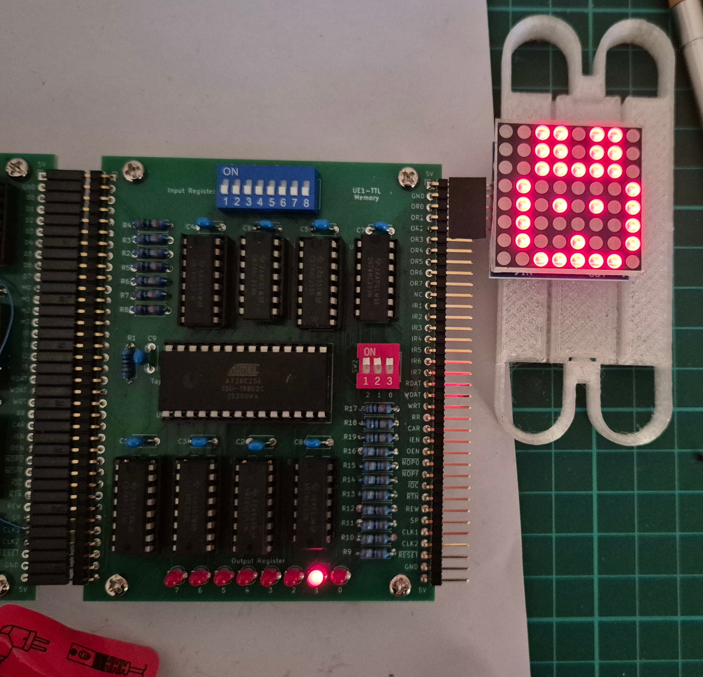

This directory contains a 32K ROM image `UE1TEST.ROM` that can be used
to test the functionality of the UE1-TTL computer.

The ROM can hold up to eight programs, that are selected using DIP
switches on the memory board:

* 0 - UE1FIBO - Calculates the Fibonacci sequence up to 21, by Usagi Electric.
* 1 - UE1MATH - Performs addition and subtraction, by Usagi Electric.
* 2 - UE1\_DIAPER1 - Tests the entire instruction set except input and output.
* 3 - UE1\_DIAPER2 - Tests input and output.
* 4 - MUL5X5 - Multiplies two 5-bit numbers to produce a 10-bit result.
* 5 - DIV8x4 - Divides an 8-bit number by a 4-bit number to give an 8-bit quotient and a 4-bit remainder.
* 6 - UE1LIFE - 1-D game of life by decle.
* 7 - Rabbit example.

The Python script `ue1-ttl-pack.py` packs eight program images into a
single 32K ROM image.  It can be used to create ROM images with new programs.

The Rabbit example (program 7) is intended for use with an 8x8 dot matrix
LED display module that uses the MAX7221 LED driver chip.  The 3594
instructions of the program bit-bang out the SPI commands for displaying
"HELLORLD" followed by a picture of a rabbit.  See the Python script
"rabbit-gen.py" for more information on how to wire up the module.

